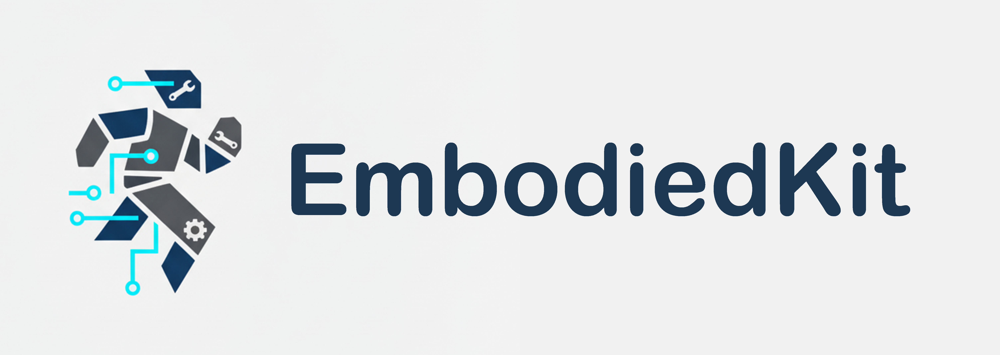

	
	
<strong>一个开源的具身智能研究平台</strong>

[English](README.md) | 简体中文

## 未来工作

- [ ] 环境配置教程：包含依赖安装、仿真/渲染工具与数据准备
- [ ] 快速开始（Start Up）：运行 Demo 的分步指南与常见问题
- [ ] 仓库结构梳理与代码重构：模块化、命名规范、文档与测试完善

以上事项均已纳入计划，后续将陆续更新，欢迎关注与贡献。
